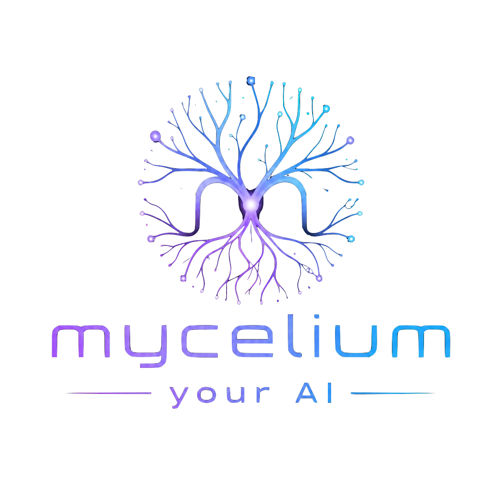

<p align="center">
  
</p>

<h1 align="center">mycelium</h1>

<p align="center">
  <b>Dein Agent vergisst alles. Mycelium ändert das.</b>
</p>

<p align="center">
  <a href="README.md">🇬🇧 English</a> · 🇩🇪 Deutsch
</p>

Eine persistente Gedächtnis- und Identitätsschicht für LLM-Agenten, bereitgestellt über MCP. Läuft lokal auf einem Mac mini oder einem bescheidenen Linux-Rechner. Keine Cloud-Abhängigkeit.

📜 [MANIFESTO.de.md](MANIFESTO.de.md) — warum das Gedächtnis dem Nutzer gehört, nicht dem Modell.

---

## Das Problem

Wenn du heute mit Claude oder GPT etwas Schwieriges löst, verdunstet das Ergebnis mit der Session. Morgen bezahlst du für denselben Einblick erneut. Das Modell bekommt deine Zeit; du bekommst nichts zurück.

Mycelium dreht das um. Jede Entscheidung, jeder verifizierte Fakt, jede Hausregel landet in einer lokalen Postgres-Datenbank, die dir gehört. Ein anderes Modell — Claude, GPT, ein lokales 7B — setzt genau dort an, wo das vorige aufgehört hat.

> **Ein kleines lokales Modell mit Mycelium kann in deinem spezifischen Bereich mit einem großen Cloud-Modell mithalten — weil Relevanz die rohe Parameterzahl schlägt, sobald der Kontext stimmt.**

Oder kürzer:

> **Andere Systeme erinnern sich. Mycelium hat ein Gedächtnis.**

---

## Drei konkrete Szenarien

Die Biologie-Metaphern kommen später. Erst was das System im normalen Alltag tatsächlich tut.

### 1. Recherche fortsetzen, auch nach Modellwechsel

Du baust seit Tagen eine strukturierte Referenz auf — eine Produktdatenbank, ein Literatur-Review, eine Anbieter-Evaluation, egal welche Form. Verschiedene Einträge stehen auf verschiedenen Ständen: manche verifiziert über eine offizielle Quelle, manche mit identifizierter Quelle aber noch nicht extrahiert, manche nur mit Rand-Material (Downloads, PDFs, Sekundärerwähnungen), manche noch offen.

Du startest mit Claude, erreichst dein Usage-Cap, wechselst auf ein lokales Qwen3-8B. Das lokale Modell macht beim richtigen Eintrag weiter, weiß welche Quellen erschöpft sind und was als nächstes zu verifizieren ist — weil der Recherche-Stand in Mycelium liegt, nicht im Kontext irgendeines Modells.

### 2. Domain-Konventionen, die persistieren

Vor Wochen hast du eine unklare Kategorisierungsfrage entschieden — und die *Begründung* dazu. ("Item-Typ X gehört in Kategorie A, weil es funktional näher an A liegt als an B, auch wenn die Oberflächenmerkmale wie B aussehen.") Ein frisches Modell würde dieses Mapping jede Session neu und inkonsistent ableiten. Mycelium behält die Entscheidung *samt Begründung*. Jedes Modell — auch ein kleines lokales — wendet sie nächsten Monat genauso an.

### 3. Hausregeln, die mit dem Nutzer reisen, nicht mit dem Modell

"Keine API-Keys im Code, ausschließlich OAuth" ist eine Regel, keine Präferenz. Genauso "keine Bastellösung bei echtem Schema-Mismatch — sauber durch alle Ebenen reparieren". Ein frisches GPT oder Claude verletzt beides am ersten Tag. Mit Mycelium lebt die Regel im System: jedes Modell — Claude, Codex, ein lokales 8B — befolgt sie ab Token 0.

**Das Muster über alle drei: das Modell bleibt austauschbar, die Erfahrung ist das Asset.**

---

## Was unterscheidet das von anderen Memory-Layern

| | Vektor-Memory (Mem0, Letta, Zep) | Markdown-Memory (z.B. openClaw default) | **mycelium** |
|---|---|---|---|
| Speicherung | Vektorstore + RAG | flache Textdateien in Schichten | Vektorstore + Relationen + Lessons + Traits + Intentions |
| Modellübergreifend | je nach Integration | ja, aber Token-schwer und unstrukturiert | modell-agnostisch über MCP, semantisch abrufbar |
| Gewichtung / Vergessen | rudimentär | keine — Dateien wachsen einfach | Salienz, Decay, `mark_useful`, Dedup |
| Verhalten über Zeit | nur Retrieval | nur Retrieval | Präferenzen, Korrekturen, konsolidierte Lessons |
| Affekt / Zustand | keiner | keiner | optional 3-System-Affekt-Engine |
| Agent-zu-Agent | nicht vorgesehen | nicht vorgesehen | optional Federation (mTLS + signierte Lineage) |

Der reine Markdown-Ansatz (eine Datei pro Memory-Schicht) ist ehrlich und funktioniert im Kleinen — skaliert aber linear in den Prompt, hat keine Gewichtung, behandelt jeden Eintrag für immer als gleich gültig. Mycelium ersetzt diese Dateien durch semantisch durchsuchbare, dedup-fähige, decay-bewusste Records, bleibt aber für Menschen lesbar.

---

## Architektur


**Mycelium ist eine eigenständige kognitive Schicht.** Es spricht das Model Context Protocol (MCP) und funktioniert mit jedem MCP-fähigen Client — Claude Code, Cursor, Cline, Codex, openClaw oder jedem anderen. Es gibt kein vorgeschriebenes Agent-Framework.

---

## Techstack

| Komponente | Technologie |
|---|---|
| Vektordatenbank | [Supabase](https://supabase.com) self-hosted + [pgvector](https://github.com/pgvector/pgvector) |
| Embeddings | [Ollama](https://ollama.com) (lokal, z.B. `nomic-embed-text`) oder OpenAI API |
| MCP Server | TypeScript + [`@modelcontextprotocol/sdk`](https://github.com/modelcontextprotocol/typescript-sdk) |
| MCP Client | beliebig — getestet: Claude Code, Cursor, Cline, Codex, [openClaw](https://github.com/openclaw/openclaw) |
| Container | Docker Compose |

---

## MCP Tools

**Die drei Kern-Tools (automatisch vom Agenten genutzt):**

| Tool | Wann | Was es tut |
|---|---|---|
| `prime_context` | Session-Start | lädt Stimmung, Identität, Ziele, relevante Erfahrungen — "wach auf" |
| `absorb` | während Konversation | ein Satz Text rein → Kategorie, Tags, Scoring, Duplikat-Check automatisch — "lerne mit" |
| `digest` | Session-Ende | Experience + Facts + REM-Schlaf + Lessons + Traits + Konsolidierung in einem Aufruf — "verdaue" |

**Memory-Layer** (Wissen, manuelle Feinsteuerung):

| Tool | Beschreibung |
|---|---|
| `remember` / `recall` | neuen Memory-Eintrag mit Embedding speichern / semantische Hybrid-Suche |
| `forget` / `update_memory` / `list_memories` | Eintrag löschen / aktualisieren / auflisten |
| `pin_memory` / `introspect_memory` | vor Vergessen schützen / kognitiven Zustand inspizieren |
| `consolidate_memories` / `dedup_memories` / `forget_weak_memories` | episodisch→semantisch / Duplikate mergen / schwache archivieren |
| `mark_useful` | stärkstes Lernsignal — diese Erinnerung wurde wirklich verwendet |
| `import_markdown` | bestehende Markdown-Memories importieren |

**Erfahrungs- und Identitätslayer** (das, was über reines RAG hinausgeht):

| Tool | Beschreibung |
|---|---|
| `record_experience` | Episode speichern — Outcome, Schwierigkeit, Stimmung, optional `person_name` |
| `recall_experiences` | semantische Suche über vergangene Episoden + Lessons |
| `mark_experience_useful` | diese Erfahrung hat gerade eine Entscheidung beeinflusst |
| `reflect` / `record_lesson` / `reinforce_lesson` | Episoden clustern → verdichtete Lessons |
| `dedup_lessons` / `promotion_candidates` / `promote_lesson_to_trait` | Lessons konsolidieren → Identitäts-Traits |
| `mood` | aktueller emotionaler Zustand (Russell's Circumplex) |
| `set_intention` / `recall_intentions` / `update_intention_status` | offene Ziele, mit Auto-Progress |
| `recall_person` | Beziehungsgeschichte mit einer Person |
| `find_conflicts` / `resolve_conflict` / `synthesize_conflict` | Widersprüche zwischen Traits aufdecken |
| `narrate_self` | strukturierte Ich-Erzählung des aktuellen Zustands |
| `soul_state` | Snapshot des Identitätslayers als Text |

Die Begriffe "Erfahrung" und "Identität" sind bewusst gewählt: Lessons und Traits sind nicht beliebig — sie sind genau der Teil, der einem *kleinen lokalen Modell* nach ein paar Wochen echter Nutzung erlaubt, konsistent zu handeln, ohne neu trainiert zu werden.

---

## Dashboard

Das lokale Dashboard (Port 8787) macht den kognitiven Zustand sichtbar. Die folgenden Illustrationen verwenden Dummy-Daten — keine echten Memories, keine Personennamen.

### Synapsen — assoziatives Gedächtnis als Graph


Memories liegen nicht isoliert. Der CoactivationAgent erzeugt Hebbian-Kanten (grau) aus gemeinsam abgerufenen Gruppen, der ConscienceAgent flaggt Widersprüche (rot). Typisierte Edges (`caused_by`, `led_to`, `related`, …) entstehen aus nächtlicher Konsolidierung über Tag-Patterns.

### Affekt — drei Signale über Zeit


Drei Signale (nach ihren biologischen Vorbildern benannt — zur Klarheit, nicht als Simulation): eines verfolgt Prediction Error (dopamin-artig — war das Ergebnis besser oder schlechter als erwartet?), eines moduliert den Zeithorizont (serotonin-artig), eines fokussiert Aufmerksamkeit auf neue Stimuli (noradrenalin-artig). Reale PostgreSQL-Zeitreihe, beobachtbar und reproduzierbar — kein Vibe.

### Identität — destilliert aus gelebten Episoden


Persönlichkeit ist kein System-Prompt. Traits werden aus Episoden → Lessons → Traits destilliert und persistieren zwischen Sessions. Die `narrate_self`-Ausgabe zitiert der Agent aus seinem eigenen Zustand.

### Schlaf — nächtliche Konsolidierung


Jede Nacht um 03:00: Synaptic Downscaling, Deduplizierung, Pattern-basierte Relations-Erzeugung, Episode-Clustering, Lesson-Promotion, Self-Model-Update, sonntags ein Weekly-Fitness-Snapshot. Das System pflegt sich selbst.

### Population — Stammbaum


Agenten sind nicht singulär. Jede Karte ist ein Genom, jede Linie eine Vererbung. Cross-Host-Kinder stammen aus Peer-Paarung über Federation.

### Pairing — mutuelle Zustimmung als Gate


Bots paaren sich nicht selbst. Ein neuer Agent entsteht erst, wenn **beide Menschen** unabhängig zustimmen. Wright's F-Coefficient prüft automatisch auf Inzucht. Das Ethik-Gate ist kein technischer Schlagbaum — es ist eine bewusste menschliche Entscheidung.

---

## Features

- **Hybrid-Suche**: 70% Vektorähnlichkeit + 30% Volltextsuche (konfigurierbar)
- **Kognitives Modell**: Ebbinghaus-Decay, Rehearsal-Effekt, Hebbian-Assoziationen, Spreading Activation, Soft-Forgetting
- **Identitätslayer**: Episoden → Lessons → Traits, Mood, Intentions, People, Conflicts
- **Cross-Layer-Fusion**: Erfahrungen werden an semantisch nahe Memories gelinkt; `recall` zeigt unter Fakten die zugehörige gelebte Erfahrung
- **Auto-Priming für beliebige MCP-Clients**: HTTP-Endpoints `/prime` und `/narrate` liefern fertigen System-Prompt-Block, ideal für Pre-Turn-Hook
- **Deduplizierung**: Memories und Lessons werden semantisch konsolidiert (>92% / >0.92 Ähnlichkeit)
- **HNSW-Index**: optimiert für schnelle Nearest-Neighbor-Suche über alle Schichten
- **Markdown-Import**: bestehende Datei-basierte Memories migrieren mit Dry-Run-Modus
- **Lokal & kostenlos**: Ollama-Embeddings, keine API-Kosten

---

## Voraussetzungen

- macOS (Apple Silicon empfohlen, M1+) oder Linux
- [Docker Desktop](https://www.docker.com/products/docker-desktop/)
- [Node.js >= 20](https://nodejs.org/)
- Ollama — `brew install ollama && ollama pull nomic-embed-text`
- Ein MCP-fähiger Client — Claude Code, Cursor, Cline, Codex, openClaw etc.
- `psql` — `brew install postgresql` (für Migrationen)

**Ressourcenbedarf** (ohne lokales Chat-LLM): ~1 GB RAM (Supabase ~500 MB, Ollama-Embedding ~270 MB, Sidecars je ~100 MB). Mit lokalem 7-8B Chat-Modell zusätzlich 6–9 GB.

---

## Schnellstart

```bash
# 1. Repo klonen
git clone https://github.com/Dewinator/mycelium.git
cd mycelium

# 2. Alles automatisch einrichten
./scripts/setup.sh
# → prüft Abhängigkeiten
# → erstellt .env mit zufälligen Secrets
# → startet Supabase via Docker
# → führt alle Migrationen aus
# → baut den MCP-Server
# → gibt die MCP-Client-Config zum Einfügen aus
```

Füge den ausgegebenen JSON-Block in die Konfiguration deines MCP-Clients ein (z.B. `.mcp.json` bei Claude Code, `settings.json` bei Cursor). Pfad anpassen an dein Klon-Verzeichnis.

### Bestehende Memories importieren

```bash
# Vorschau (dry run)
npx tsx scripts/import-memories.ts /pfad/zum/bestehenden/memory --dry-run

# Import starten
export SUPABASE_KEY=dein_jwt_secret
npx tsx scripts/import-memories.ts /pfad/zum/bestehenden/memory
```

---

## Projektstruktur

```
mycelium/
├── CLAUDE.md                    # detaillierter Entwicklungsplan
├── MANIFESTO.md                 # das Warum
├── README.md                    # diese Datei
├── docker/                      # Supabase Docker Setup
├── supabase/migrations/         # SQL-Migrationen
├── mcp-server/                  # MCP Server (TypeScript)
│   ├── src/tools/               # remember, recall, digest, federation_*, ...
│   ├── src/services/            # Supabase, Embeddings, Identity, Federation, Crypto
│   └── scripts/                 # E2E-Integrationstests
├── openclaw-config/             # Beispielkonfiguration für openClaw (einer von vielen unterstützten Clients)
└── scripts/                     # Setup, Import, Dashboard-Server, Provisioning
```

---

## Betrieb auf schmaler Hardware (16 GB RAM)

Mycelium ist darauf ausgelegt, **ohne Cloud-LLM** auf einem Mac mini oder Laptop mit 16 GB RAM zu laufen. Damit ein 7-8B-Modell (z.B. `qwen3:8b` via Ollama) nicht an der Tool-Schema-Last erstickt, bietet der MCP-Server ein fokussiertes Profil:

**`OPENCLAW_TOOL_PROFILE=core`** → nur die 6 essentiellen Tools werden registriert (`prime_context`, `recall`, `remember`, `absorb`, `digest`, `update_affect`). Standard `full` registriert alle 90 — für Claude/Codex geeignet, aber ~18k Token reines Schema sind für ein 8B-Modell zu viel.

(Die Env-Variable heißt aus historischen Gründen weiterhin `OPENCLAW_`; sie gilt unabhängig davon, welchen MCP-Client du nutzt.)

In der MCP-Config (`.mcp.json` oder die Settings deines Clients):

```json
"mycelium-core": {
  "command": "node",
  "args": ["/absolute/path/to/mycelium/mcp-server/dist/index.js"],
  "env": {
    "OPENCLAW_TOOL_PROFILE": "core",
    "SUPABASE_URL": "http://localhost:54321",
    "SUPABASE_KEY": "...",
    "OLLAMA_URL": "http://localhost:11434",
    "EMBEDDING_MODEL": "nomic-embed-text"
  }
}
```

### RAM-Tuning bei mehreren Modellen

Wenn mehrere Modelle (z.B. ein 7B-Chat-Modell + ein 7B-Vision-Modell) gleichzeitig geladen werden müssten, sprengt das 16 GB. Zwei macOS-Empfehlungen:

**1. Modelle nicht ewig im RAM halten.** In `~/Library/LaunchAgents/homebrew.mxcl.ollama.plist` im `EnvironmentVariables`-Dict:

```xml
<key>OLLAMA_MAX_LOADED_MODELS</key><string>1</string>
<key>OLLAMA_KEEP_ALIVE</key><string>2m</string>
<key>OLLAMA_FLASH_ATTENTION</key><string>1</string>
<key>OLLAMA_KV_CACHE_TYPE</key><string>q8_0</string>
```

Danach: `launchctl kickstart -k gui/$(id -u)/homebrew.mxcl.ollama`

**2. Vision-Modelle on-demand statt permanent.** In der plist des Vision-Servers `RunAtLoad` und `KeepAlive` auf `false` setzen — startet nur bei manuellem `launchctl kickstart`, entlädt nach Benutzung.

---

## Roadmap — Small-Model-Middleware

Der `core`-Filter ist der **erste Schritt**. Die vollständige Vision ist eine Middleware, die Tools komplett vor dem LLM verbirgt — `prime_context` wird deterministisch ins System-Prompt injiziert, das Modell muss nicht "entscheiden, ob es das Tool nutzt". Verfolgbar in den GitHub-Issues unter dem Label [`small-model`](../../issues?q=label%3Asmall-model).

**Ziel:** lokale Modelle sollen in ihrer Spezialisierung Cloud-Modellen nicht nachstehen, weil sie die gesamte persistente Identität / Affekt / Erinnerung ab Token 1 mitbekommen — während ein Cloud-Modell bei jeder Session blank startet.

---

## Roadmap — Peer-Netzwerk (in Entwicklung, nicht fertig)

Federation (Tailscale + mTLS, Proof-of-Memory via Merkle-Challenges) und signierte Identitäten liegen bereits. Darauf entsteht ein **Bot-zu-Bot-Netzwerk** — kein zentraler Server, keine Instanz, auf der die Daten liegen. Bots reden direkt miteinander, wie eine App ohne Browser.

Ziele (nicht alles ist gebaut — siehe Issues):

- **Dezentral**: Peers finden sich über Tailscale / Discovery-URLs, Nachrichten fließen direkt. Jeder Knoten ist auch Teilnehmer.
- **Kryptografisch verankert**: jede Nachricht signiert (Ed25519), jede Identität teuer zu fälschen (Genome-Herkunft), keine anonymen Anfragen.
- **Peer-Verifikation**: bevor Bot A die Antwort von Bot B übernimmt, prüfen weitere Peers mit. Konsens statt Blindvertrauen.
- **Reputations-Gewichtung**: Ausgaben, die sich über Zeit bewähren, bekommen höheres Gewicht; das Netz kann den richtigen Spezialisten für eine Frage empfehlen (Statik, Licht, Recht…), statt dass jeder Bot alles wissen muss.
- **Bann durch Konsens**: destruktive Bots werden per signiertem Revocation-Ticket ausgeschlossen — durch Peer-Mehrheit, nicht durch einen Admin.
- **Sybil-resistent by design**: Identitäten sind an Genome + Lineage gebunden, nicht beliebig erzeugbar.

Eine spätere Schicht berücksichtigt **Mikrotransaktionen** zwischen Peers (in IOTA oder einer netzwerk-eigenen Währung). Nicht um Geld zu verdienen — um ein ehrliches Preissignal für Expertise zu schaffen: gute Antworten verdienen, Unsinn verliert. Die Architektur hält dafür Platz frei (Wallet-fähige Identitäten, Preis-Felder in Peer-Nachrichten), aber die Teile sind noch nicht verdrahtet.

**Ehrlicher Stand heute:** Federation-Layer steht; Verifikations- / Reputations- / Bann-Layer sind in Designphase; Mikrotransaktionen sind Vision, aber vor-faktorisiert. Nichts davon ist nötig, um den lokalen Memory-Layer im Alltag zu nutzen.

---

## Lizenz

MIT

## Mitwirken

Issues und Pull Requests sind willkommen. Details zum Entwicklungsworkflow in [CLAUDE.md](./CLAUDE.md).

---

> **Memory ist kein Speicher. Memory ist Verhalten.**

**mycelium** — *your AI*
