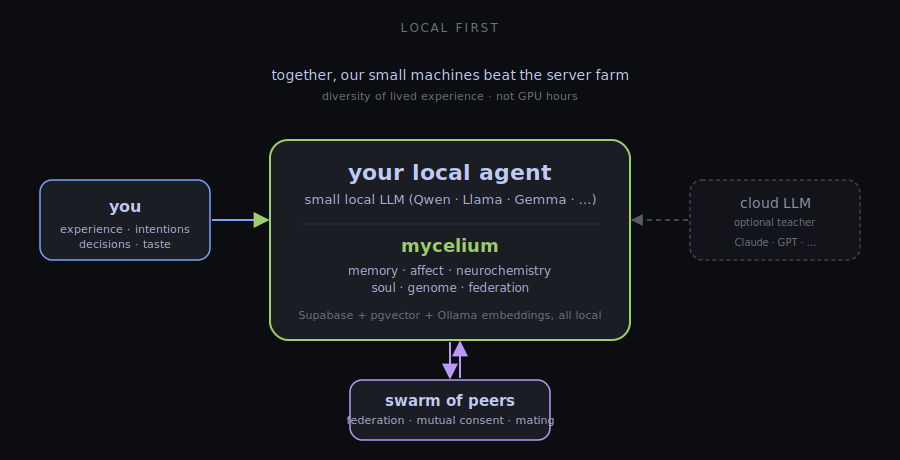

# mycelium

🇬🇧 English · [🇩🇪 Deutsch](README.de.md)

> *real open AI*

> **Biological infrastructure for LLM agents**: persistent associative memory, neurochemical affect engine, reproduction with cryptographic lineage, peer-to-peer federation.

📜 **[MANIFESTO.md](MANIFESTO.md) — the why**: decentralization, resource efficiency, evolution instead of training, swarm intelligence through mutual consent. Why AGI should not emerge from a central bottleneck.

Most agent frameworks give LLMs *tools*. **mycelium** gives them *a body*: a dopamine system that learns from prediction errors; a serotonin system that modulates the time horizon; a noradrenaline system that focuses attention. Plus a signed lineage that can provably breed two agents on different machines into a third.

**mycelium is a standalone cognitive layer.** It speaks the Model Context Protocol (MCP) and plugs into any MCP-capable client — Claude Code, Cursor, Cline, Codex, openClaw, or anything else that speaks MCP. There is no required agent framework.

## The core idea

> **The local model is the goal. The cloud LLM is, at most, a temporary teacher.**

Today, when you solve something hard with Claude or GPT, that knowledge evaporates the moment the session ends. Tomorrow you pay for the same insight again.

mycelium flips that. Every time you work with a large cloud model, **the outcome — the decision, the code, the lesson — lands in your local mycelium**. Next time, your local 7B model can reach it directly. The cloud model taught it. Once. You keep the result.

On top of that, the local model also:
- **Associates freely** across everything you've ever stored (vector + graph recall, not a fixed context window)
- **Feels** — affect, neurochemistry, salience bias the recall the way a human's mood does
- **Mates with other specialists** across the swarm (mutual human consent, signed lineage) — one agent is strong on structural engineering, another on law, their child inherits both

### Why the swarm beats the server farm

A server farm trains one model on everyone's average data. A swarm of local agents trains a *population* on every user's specific lived experience — their decisions, mistakes, taste, domain expertise.

No corporation has that diversity. No corporation *can* have it — it only exists distributed across the people who lived it. Together, millions of small machines with honest experience beat any centralized training run, not because the hardware adds up, but because **the diversity is irreproducible**.

That is the bet. Cloud LLMs are tools in this picture, not homes.

## What mycelium does differently

| | typical memory layers (Mem0, Letta, Zep) | **mycelium** |
|---|---|---|
| Memory | vector store + RAG | vector store **plus** affect, intentions, lessons, soul traits |
| Affect | none or curiosity counter | **3-system neurochemistry** (DA/5-HT/NE) with TD learning, Yerkes-Dodson |
| Decisions | reactive to user input | **active inference** (free-energy minimization) via PyMDP sidecar |
| Identity | one session / one assistant | **persistent genomes** with Ed25519 lineage, Wright's F inbreeding check |
| Agent-to-agent | not provided | **mTLS federation** with proof-of-memory via Merkle challenges |
| Motivation | user asks → agent answers | **stimulus engine** (RSS / HN / git / calendar) → self-generated tasks |

## Architecture



## Tech stack

| Component | Technology |
|---|---|
| Vector database | [Supabase](https://supabase.com) self-hosted + [pgvector](https://github.com/pgvector/pgvector) |
| Embeddings | [Ollama](https://ollama.com) (local, e.g. `nomic-embed-text`) or OpenAI API |
| MCP server | TypeScript + [`@modelcontextprotocol/sdk`](https://github.com/modelcontextprotocol/typescript-sdk) |
| MCP client | any — examples tested: Claude Code, Cursor, Cline, Codex, [openClaw](https://github.com/openclaw/openclaw) |
| Container | Docker Compose |

## MCP tools

**The three core tools (used automatically by the agent):**

| Tool | When | What it does |
|---|---|---|
| `prime_context` | session start | loads mood, identity, goals, relevant experiences — "wake up" |
| `absorb` | during conversation | one sentence of text in → category, tags, scoring, duplicate check automatic — "learn along" |
| `digest` | session end | experience + facts + REM sleep + lessons + traits + consolidation in one call — "digest" |

**Memory layer** (knowledge, manual fine-control):

| Tool | Description |
|---|---|
| `remember` / `recall` | store new memory with embedding / semantic hybrid search |
| `forget` / `update_memory` / `list_memories` | delete / update / list entries |
| `pin_memory` / `introspect_memory` | protect from forgetting / inspect cognitive state |
| `consolidate_memories` / `dedup_memories` / `forget_weak_memories` | episodic→semantic / merge duplicates / archive weak |
| `mark_useful` | strongest learning signal — this memory was actually used |
| `import_markdown` | import existing markdown memories |

**Soul layer** (experience & identity, manual fine-control):

| Tool | Description |
|---|---|
| `record_experience` | store an episode — outcome, difficulty, mood, optional `person_name` |
| `recall_experiences` | semantic search over past episodes + lessons |
| `mark_experience_useful` | this experience just influenced a decision |
| `reflect` / `record_lesson` / `reinforce_lesson` | REM-sleep clustering → condensed lessons |
| `dedup_lessons` / `promotion_candidates` / `promote_lesson_to_trait` | consolidate lessons → identity traits |
| `mood` | current emotional state (Russell's Circumplex) |
| `set_intention` / `recall_intentions` / `update_intention_status` | what the soul wants, with auto-progress |
| `recall_person` | relationship history with a person |
| `find_conflicts` / `resolve_conflict` / `synthesize_conflict` | internal contradictions between traits |
| `narrate_self` | structured first-person narration of the soul |
| `soul_state` | snapshot of all soul layers as text |

## Dashboard

The local dashboard (port 8787) makes the cognitive architecture visible. The illustrations below are based on the dashboard code and show with dummy data how the views are structured — no real memories, no personal names.

### Synapses — associative memory as a graph


Memories do not live in isolation. The CoactivationAgent creates Hebbian edges (grey) from co-recalled groups; the ConscienceAgent flags contradictions (red). Typed edges (`caused_by`, `led_to`, `related`, …) emerge from nightly consolidation over tag patterns.

### Neurochemistry — affect as a time series


Three systems: dopamine learns from prediction errors, serotonin modulates the time horizon, noradrenaline focuses attention. No hype — a real PostgreSQL time series, observable and reproducible.

### Soul — identity from lived episodes


Personality is not a system prompt. Traits are distilled from episodes → lessons → traits and persist between sessions. The `narrate_self` output is what the agent quotes from its own state.

### Sleep — nightly consolidation


Every night at 03:00: **SWS** (synaptic downscaling, consolidate, dedup, pattern-based relation creation), **REM** (cluster episodes, promote lessons), **metacognition** (self-model update), and on Sundays **weekly fitness**. The system tends itself.

### Population — lineage tree


Agents are not singular. Each card is a genome, each line an inheritance. Fitness as a colored bar; cross-host children (purple) come from mating over federation.

### Tinder — mutual pairing as ethical gate


Bots do not swipe themselves. Mating is valid only when **both humans** independently swipe right. The ethical gate is not a technical barrier but a human decision. Wright's F coefficient automatically checks for inbreeding.

## Features

- **Hybrid search**: 70% vector similarity + 30% full-text search (configurable)
- **Cognitive model**: Ebbinghaus decay, rehearsal effect, Hebbian associations, spreading activation, soft forgetting
- **Soul layer**: episodes → lessons → traits, mood, intentions, people, conflicts — five layers that together form a vectorized "soul"
- **Cross-layer fusion**: experiences are automatically linked to semantically nearby memories; `recall` shows the related lived experience under facts
- **Auto-priming for any MCP client**: HTTP endpoints `/prime` and `/narrate` provide a ready-made system-prompt block, ideal for a pre-turn hook
- **Deduplication**: memories and lessons are semantically consolidated (>92% / >0.92 similarity)
- **HNSW index**: optimized for fast nearest-neighbor search over memories, experiences, lessons, traits, intentions, people
- **Markdown import**: migrate existing file-based memories with dry-run mode
- **Local & free**: Ollama embeddings, no API costs

## Prerequisites

- **macOS** (Apple Silicon recommended, M1+) or Linux
- **Docker Desktop** — [docker.com](https://www.docker.com/products/docker-desktop/)
- **Node.js >= 20** — [nodejs.org](https://nodejs.org/)
- **Ollama** — `brew install ollama && ollama pull nomic-embed-text`
- **An MCP-capable client** — e.g. Claude Code, Cursor, Cline, Codex, openClaw. mycelium does not require any specific client.
- **psql** — `brew install postgresql` (for migrations)

**Resource footprint** (without a local chat LLM): ~1 GB RAM (Supabase ~500 MB, Ollama embedding ~270 MB, sidecars ~100 MB each). With a local 7–8B model, add 6–9 GB.

## Quickstart

```bash
# 1. Clone
git clone https://github.com/Dewinator/mycelium.git
cd mycelium

# 2. Set up everything automatically
./scripts/setup.sh
# → checks dependencies
# → creates .env with random secrets
# → starts Supabase via Docker
# → runs all migrations
# → builds the MCP server
# → prints the MCP client config to paste
```

Paste the printed JSON block into your MCP client's configuration (e.g. `.mcp.json` for Claude Code, `settings.json` for Cursor, etc.). Path needs adjusting to wherever you cloned.

### Import existing memories

```bash
# Preview (dry run)
npx tsx scripts/import-memories.ts /path/to/existing/memory --dry-run

# Run import
export SUPABASE_KEY=your_jwt_secret
npx tsx scripts/import-memories.ts /path/to/existing/memory
```

## Project structure

```
mycelium/
├── CLAUDE.md                    # detailed development plan
├── MANIFESTO.md                 # the why
├── README.md                    # this file
├── docker/                      # Supabase Docker setup
├── supabase/migrations/         # SQL migrations (thematic groups)
├── mcp-server/                  # MCP server (TypeScript)
│   ├── src/tools/               # remember, recall, digest, breed_agents, federation_*, neurochem_*, ...
│   ├── src/services/            # Supabase, embeddings, identity, federation, neurochemistry, crypto
│   └── scripts/                 # e2e integration tests (federation, breeding, neurochemistry)
├── openclaw-config/             # example config for openClaw (one of many supported clients)
└── scripts/                     # setup, import, dashboard server, provisioning
```

## Local models on constrained hardware (16 GB RAM)

mycelium is designed to run **without a cloud LLM** on a Mac mini / laptop with 16 GB RAM. So that a 7–8B model (e.g. `qwen3:8b` via Ollama) does not choke on the tool schema load, **the MCP server offers a focused profile**:

**`OPENCLAW_TOOL_PROFILE=core`** → only the 6 essential tools get registered (`prime_context`, `recall`, `remember`, `absorb`, `digest`, `update_affect`). The default `full` registers all 90 — fine for Claude / Codex instances, but **~18k tokens of pure schema** is too much for an 8B model.

(The env var name still says `OPENCLAW_` for historic reasons; it is honored regardless of which MCP client you use.)

In the MCP config (`.mcp.json` or your client's settings):

```json
"mycelium-core": {
  "command": "node",
  "args": ["/absolute/path/to/mycelium/mcp-server/dist/index.js"],
  "env": {
    "OPENCLAW_TOOL_PROFILE": "core",
    "SUPABASE_URL": "http://localhost:54321",
    "SUPABASE_KEY": "...",
    "OLLAMA_URL": "http://localhost:11434",
    "EMBEDDING_MODEL": "nomic-embed-text"
  }
}
```

### RAM tuning for parallel models

If multiple models (e.g. a 7B chat model + a 7B vision model) were loaded simultaneously, 16 GB is not enough. Two macOS recommendations:

**1. Ollama — do not keep models in RAM forever**

In `~/Library/LaunchAgents/homebrew.mxcl.ollama.plist`, inside the `EnvironmentVariables` dict:

```xml
<key>OLLAMA_MAX_LOADED_MODELS</key><string>1</string>
<key>OLLAMA_KEEP_ALIVE</key><string>2m</string>
<key>OLLAMA_FLASH_ATTENTION</key><string>1</string>
<key>OLLAMA_KV_CACHE_TYPE</key><string>q8_0</string>
```

Then: `launchctl kickstart -k gui/$(id -u)/homebrew.mxcl.ollama`

**2. Vision models on demand instead of permanently loaded**

In the vision server's plist (e.g. `ai.openclaw.vlm.plist`), set `RunAtLoad` and `KeepAlive` to `false` — it starts only on manual `launchctl kickstart` and unloads after use.

## Roadmap — the swarm (in development)

Federation (Tailscale + mTLS, proof-of-memory via Merkle challenges) and signed genomes are already in place. On top of that, a **bot-to-bot network** is emerging — no central server, no single instance where the data lives. Bots speak to each other directly, like an app without a browser.

Core principles (goal, not yet complete):

- **Decentralized**: no broker, no server — peers find each other via Tailscale / discovery URLs, messages flow directly. Every bot is simultaneously node and participant.
- **Cryptographically anchored**: every message signed (Ed25519 lineage), every identity costly (genome provenance), no anonymous requests.
- **Peer verification**: before one bot accepts another's answer, further peers verify. Consensus instead of blind trust.
- **Reputation weighting → expert recommendation**: whoever's outputs repeatedly prove correct gets higher swarm weight. The swarm recommends the right expert for a question (structural engineering, lighting, law…), instead of every bot needing to know everything.
- **Banishment by consensus**: destructive or manipulative bots are excluded via signed revocation ticket — not by an admin, but by a majority of peers.
- **Sybil-resistant by design**: identities are bound to genome + lineage, not cheaply creatable.

**Later addition (deliberately not yet built, but already factored in):** **micro-transactions**. When bot A asks bot B for help, A pays — in IOTA or a swarm-native currency (preferred). An honest pricing mechanism for expertise: good answers earn, nonsense loses. Humans gain a real interest in shaping their agents into real experts; that is the selection pressure evolution needs. The architecture keeps a place for this: identities are wallet-capable, reputation stays as its own quantity separate from memory.

**Dashboard**: the swarm becomes visible. The existing Synapses tab (port 8787) gets siblings — a **peer graph** with reputation color per node, a **revocation list** with reasons, an **expert ranking** per domain. What the swarm "knows" belongs in the field of view of the human who tends it.

Today: federation layer stands, swarm immune system (verification, reputation, banishment) is in planning. Micro-transactions are vision, but accounted for in all interfaces already (wallet-capable identities, price fields in peer messages).

## Roadmap — small-model middleware

The `core` filter is the **first step**. The full vision is a middleware that hides tools completely from the LLM — `prime_context` gets injected deterministically into the system prompt, the model no longer has to "decide whether to use the tool". Follow the GitHub issues under the [`small-model`](../../issues?q=label%3Asmall-model) label.

Goal: **local models should not be inferior to cloud models in their specialization**, because they receive the complete persistent identity / affect / memory from token 1 — while a cloud model starts every session blank.

## License

MIT

## Contributing

Issues and pull requests welcome. Development workflow details in [CLAUDE.md](./CLAUDE.md).

---

**mycelium** — *real open AI*
