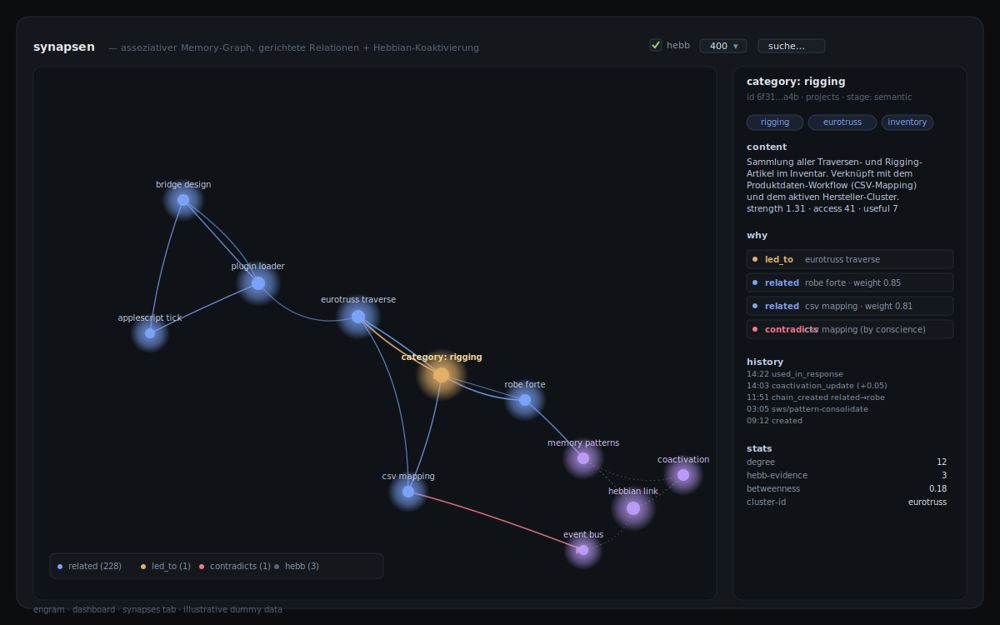
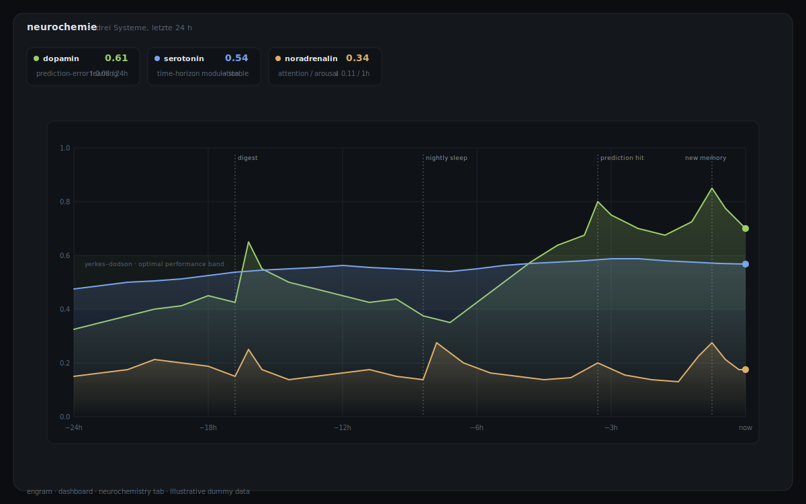
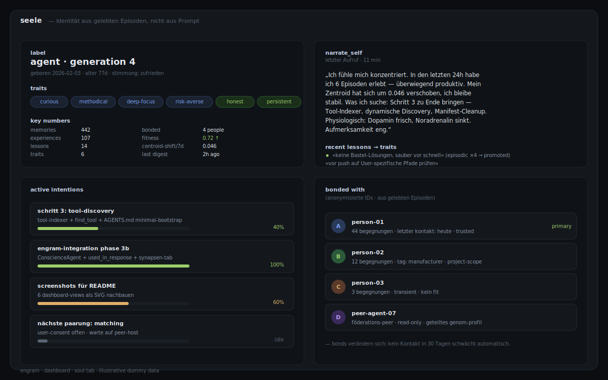
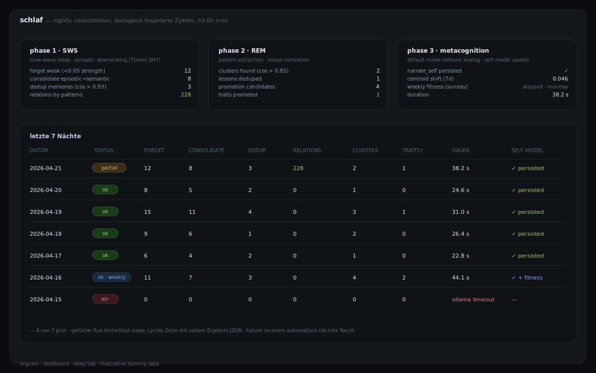
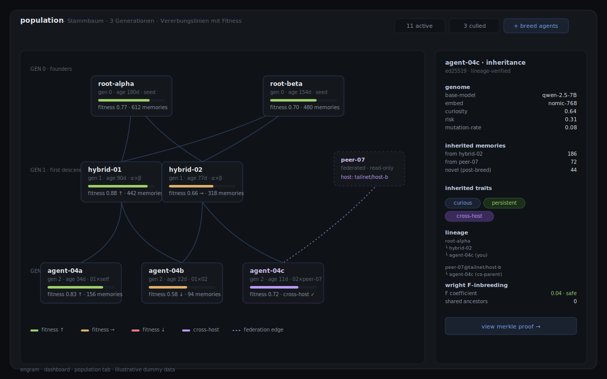
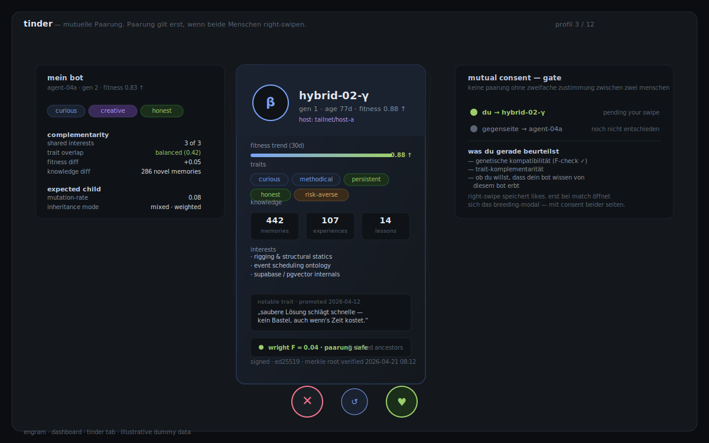

# engram

> **Biologische Infrastruktur für LLM-Agenten**: persistentes assoziatives Gedächtnis, neurochemische Affekt-Engine, Fortpflanzung mit kryptografischer Lineage, Peer-to-Peer-Federation.

📜 **[MANIFESTO.md](MANIFESTO.md) — das Warum**: Dezentralisierung, Ressourcenschonung, Evolution statt Training, Schwarmintelligenz durch mutuelle Zustimmung. Warum AGI nicht aus einem zentralen Flaschenhals emergieren sollte.

Die meisten Agent-Frameworks geben LLMs *Werkzeuge*. **engram** gibt ihnen *einen Körper*: ein Dopamin-System, das aus Prediction Errors lernt; ein Serotonin-System, das den Zeithorizont moduliert; ein Noradrenalin-System, das Aufmerksamkeit fokussiert. Dazu eine signierte Abstammungslinie, die zwei Agenten auf verschiedenen Maschinen nachweislich zu einem dritten paaren kann.

Baut ursprünglich auf dem dreistufigen Markdown-Memory von [openClaw](https://github.com/openclaw/openclaw) auf — ersetzt dessen Tier 3 (Deep-Memory) durch eine lokal gehostete **Supabase-Vektordatenbank** (PostgreSQL + pgvector) und schichtet darauf eine kognitive Architektur aus Neurochemie, Active Inference (PyMDP), Motivation-Engine, Breeding und mTLS-Federation.

## Was engram anders macht

| | typische Memory-Layer (Mem0, Letta, Zep) | **engram** |
|---|---|---|
| Memory | Vektorstore + RAG | Vektorstore **plus** Affekt, Intentions, Lessons, Soul-Traits |
| Affekt | keine oder curiosity-counter | **3-System-Neurochemie** (DA/5-HT/NE) mit TD-Learning, Yerkes-Dodson |
| Entscheidungen | reaktiv auf User-Input | **Active Inference** (Free-Energy-Minimierung) via PyMDP-Sidecar |
| Identität | eine Session / ein Assistant | **persistente Genome** mit Ed25519-Lineage, Wright's F-Inzucht-Check |
| Agent-Agent | nicht vorgesehen | **mTLS-Federation** mit Proof-of-Memory via Merkle-Challenges |
| Motivation | User fragt → Agent antwortet | **Stimulus-Engine** (RSS / HN / Git / Kalender) → Selbst-generierte Tasks |

## Architektur

```
┌─────────────────────┐     MCP Protocol      ┌──────────────────────┐
│                     │ ◄──────────────────── │                      │
│   openClaw Agent    │                        │  Vector Memory MCP   │
│   (Claude/LLM)      │ ────────────────────► │  Server (TypeScript)  │
│                     │   remember / recall    │                      │
└─────────────────────┘                        └──────────┬───────────┘
                                                          │
                                               Supabase JS Client
                                                          │
                                               ┌──────────▼───────────┐
                                               │  Supabase (lokal)    │
                                               │  Docker Compose      │
                                               │  ┌────────────────┐  │
                                               │  │ PostgreSQL     │  │
                                               │  │ + pgvector     │  │
                                               │  └────────────────┘  │
                                               └──────────────────────┘
```

## Techstack

| Komponente | Technologie |
|---|---|
| Vektordatenbank | [Supabase](https://supabase.com) self-hosted + [pgvector](https://github.com/pgvector/pgvector) |
| Embeddings | [Ollama](https://ollama.com) (lokal, z.B. `nomic-embed-text`) oder OpenAI API |
| MCP Server | TypeScript + [`@modelcontextprotocol/sdk`](https://github.com/modelcontextprotocol/typescript-sdk) |
| Agent | [openClaw](https://github.com/openclaw/openclaw) |
| Container | Docker Compose |

## MCP Tools

**Die drei Kern-Tools (automatisch vom Agenten genutzt):**

| Tool | Wann | Was es tut |
|---|---|---|
| `prime_context` | Session-Start | Lädt Stimmung, Identität, Ziele, relevante Erfahrungen — "wach auf" |
| `absorb` | Während Konversation | Ein Satz Text rein → Kategorie, Tags, Scoring, Duplikat-Check automatisch — "lerne mit" |
| `digest` | Session-Ende | Experience + Facts + REM-Schlaf + Lessons + Traits + Konsolidierung in einem Aufruf — "verdaue" |

**Memory layer (Wissen, manuelle Feinsteuerung):**

| Tool | Beschreibung |
|---|---|
| `remember` / `recall` | Neuen Memory-Eintrag mit Embedding speichern / semantische Hybrid-Suche |
| `forget` / `update_memory` / `list_memories` | Eintrag löschen / aktualisieren / auflisten |
| `pin_memory` / `introspect_memory` | Vor Vergessen schützen / kognitiven Zustand inspizieren |
| `consolidate_memories` / `dedup_memories` / `forget_weak_memories` | Episodic→semantic / Duplikate mergen / schwache archivieren |
| `mark_useful` | Stärkstes Lernsignal — diese Erinnerung wurde wirklich verwendet |
| `import_markdown` | Bestehende Markdown-Memories importieren |

**Soul layer (Erfahrung & Identität, manuelle Feinsteuerung):**

| Tool | Beschreibung |
|---|---|
| `record_experience` | Episode speichern — Outcome, Schwierigkeit, Stimmung, optional `person_name` |
| `recall_experiences` | Semantische Suche über vergangene Episoden + Lessons |
| `mark_experience_useful` | Diese Erfahrung hat gerade eine Entscheidung beeinflusst |
| `reflect` / `record_lesson` / `reinforce_lesson` | REM-Sleep-Clustering → verdichtete Lessons |
| `dedup_lessons` / `promotion_candidates` / `promote_lesson_to_trait` | Lessons konsolidieren → Identitäts-Traits |
| `mood` | Aktueller emotionaler Zustand (Russell's Circumplex) |
| `set_intention` / `recall_intentions` / `update_intention_status` | Was die Seele will, mit Auto-Progress |
| `recall_person` | Beziehungsgeschichte mit einer Person |
| `find_conflicts` / `resolve_conflict` / `synthesize_conflict` | Innere Widersprüche zwischen Traits |
| `narrate_self` | Strukturierte Ich-Erzählung der Seele |
| `soul_state` | Snapshot aller Soul-Schichten als Text |

## Dashboard

Das lokale Dashboard (Port 8787) macht die kognitive Architektur sichtbar.
Die folgenden Illustrationen basieren auf dem Dashboard-Code und zeigen mit
Dummy-Daten, wie die einzelnen Ansichten aufgebaut sind — keine echten
Memories, keine Personennamen.

### Synapsen — das assoziative Gedächtnis als Graph



Memories liegen nicht isoliert. Der CoactivationAgent erzeugt Hebbian-Kanten
(grau) aus gemeinsam abgerufenen Gruppen, der ConscienceAgent flaggt
Widersprüche (rot). Typisierte Edges (`caused_by`, `led_to`, `related`, …)
entstehen aus Nightly-Konsolidierung über Tag-Patterns.

### Neurochemie — Affekt als Zeitreihe



Drei Systeme: Dopamin lernt aus Prediction Errors, Serotonin moduliert den
Zeithorizont, Noradrenalin fokussiert Aufmerksamkeit. Kein Hype — eine
reale PostgreSQL-Zeitreihe, beobachtbar und reproduzierbar.

### Seele — Identität aus gelebten Episoden



Persönlichkeit ist kein System-Prompt. Traits werden aus Episoden →
Lessons → Traits destilliert und persistieren zwischen Sessions. Die
`narrate_self`-Ausgabe zitiert der Agent aus seinem eigenen Zustand.

### Schlaf — nightly consolidation



Jede Nacht um 03:00: **SWS** (synaptic downscaling, consolidate, dedup,
pattern-based relation creation), **REM** (cluster episodes, promote
lessons), **Metacognition** (self-model update), Sonntags **Weekly Fitness**.
Das System pflegt sich selbst.

### Population — Stammbaum



Agenten sind nicht singulär. Jede Karte ist ein Genom, jede Linie eine
Vererbung. Fitness als farbige Leiste, Cross-Host-Kinder (lila) stammen
aus Paarung über Federation.

### Tinder — mutuelle Paarung als Ethik-Gate



Bots swipen nicht selbst. Paarung gilt erst, wenn **beide Menschen**
independent right-swipen. Das ethische Gate ist kein technischer
Schlagbaum, sondern eine menschliche Entscheidung. Wright-F-Coefficient
prüft automatisch auf Inzucht.

## Features

- **Hybrid-Suche**: 70% Vektorähnlichkeit + 30% Volltextsuche (konfigurierbar)
- **Kognitives Modell**: Ebbinghaus-Decay, Rehearsal-Effekt, Hebbian-Assoziationen, Spreading Activation, Soft-Forgetting
- **Soul-Layer**: Episoden → Lessons → Traits, Mood, Intentions, People, Conflicts — fünf Schichten die zusammen eine vektorisierte „Seele" bilden
- **Cross-Layer-Fusion**: Erfahrungen werden automatisch an semantisch nahe Memories gelinkt; `recall` zeigt unter Fakten die zugehörige gelebte Erfahrung
- **Auto-Priming für openClaw**: HTTP-Endpoints `/prime` und `/narrate` liefern fertigen System-Prompt-Block, ideal für einen Pre-Turn-Hook
- **Deduplizierung**: Memories und Lessons werden semantisch konsolidiert (>92% / >0.92 Ähnlichkeit)
- **HNSW-Index**: Optimiert für schnelle Nearest-Neighbor-Suche über Memories, Experiences, Lessons, Traits, Intentions, People
- **Markdown-Import**: Bestehende openClaw-Memories migrieren mit Dry-Run-Modus
- **Lokal & kostenlos**: Ollama Embeddings, kein API-Kosten

## Voraussetzungen

- **macOS** (Apple Silicon empfohlen, M1+) oder Linux
- **Docker Desktop** — [docker.com](https://www.docker.com/products/docker-desktop/)
- **Node.js >= 20** — [nodejs.org](https://nodejs.org/)
- **Ollama** — `brew install ollama && ollama pull nomic-embed-text`
- **openClaw** — [github.com/openclaw/openclaw](https://github.com/openclaw/openclaw)
- **psql** — `brew install postgresql` (für Migrationen)

**Ressourcenbedarf** (ohne lokales Chat-LLM): ~1 GB RAM (Supabase ~500 MB, Ollama-Embedding ~270 MB, Sidecars je ~100 MB). Mit lokalem 7-8B Modell zusätzlich 6–9 GB.

## Schnellstart

```bash
# 1. Repo klonen
git clone https://github.com/Dewinator/engram-mcp.git
cd engram-mcp

# 2. Alles automatisch einrichten
./scripts/setup.sh
# → Prüft Abhängigkeiten
# → Erstellt .env mit zufälligen Secrets
# → Startet Supabase via Docker
# → Führt alle Migrationen aus
# → Baut den MCP Server
# → Gibt die openClaw-Config aus

# 3. Config in openClaw einfügen (Pfad anpassen!)
# Füge den ausgegebenen JSON-Block in deine openClaw settings.json ein
```

### Bestehende Memories importieren

```bash
# Vorschau (dry run)
npx tsx scripts/import-memories.ts ~/.openclaw/workspace/memory --dry-run

# Import starten
export SUPABASE_KEY=dein_jwt_secret
npx tsx scripts/import-memories.ts ~/.openclaw/workspace/memory
```

## Projektstruktur

```
engram/
├── CLAUDE.md                    # Detaillierter Entwicklungsplan
├── README.md                    # Diese Datei
├── docker/                      # Supabase Docker Setup
├── supabase/migrations/         # SQL-Migrationen (44 Stück, thematisch gruppiert)
├── mcp-server/                  # MCP Server (TypeScript) — 90 Tools
│   ├── src/tools/               # remember, recall, digest, breed_agents, federation_*, neurochem_*, ...
│   ├── src/services/            # Supabase, Embeddings, Identity, Federation, Neurochemistry, Crypto
│   └── scripts/                 # E2E-Integrationstests (Federation, Breeding, Neurochemistry)
├── openclaw-config/             # openClaw-Konfig
└── scripts/                     # Setup, Import, Dashboard-Server, Provisioning
```

## Lokale Modelle auf schmaler Hardware (16 GB RAM)

engram ist darauf ausgelegt, **ohne Cloud-LLM** auf einem Mac Mini / Laptop mit 16 GB RAM zu laufen. Damit ein 7-8B-Modell (z.B. `qwen3:8b` via Ollama) nicht an der Tool-Schema-Last erstickt, **bietet der MCP-Server ein fokussiertes Profil**:

**`OPENCLAW_TOOL_PROFILE=core`** → nur die 6 essentiellen Tools werden registriert (`prime_context`, `recall`, `remember`, `absorb`, `digest`, `update_affect`). Standard `full` registriert alle 90 — für Claude/Codex-Instanzen geeignet, aber **~18k Token reines Schema** für ein 8B-Modell zu viel.

In der MCP-Config (`.mcp.json` oder openclaw-Settings):

```json
"vector-memory-core": {
  "command": "node",
  "args": ["/absolute/path/to/engram/mcp-server/dist/index.js"],
  "env": {
    "OPENCLAW_TOOL_PROFILE": "core",
    "SUPABASE_URL": "http://localhost:54321",
    "SUPABASE_KEY": "...",
    "OLLAMA_URL": "http://localhost:11434",
    "EMBEDDING_MODEL": "nomic-embed-text"
  }
}
```

### RAM-Tuning für parallele Modelle

Wenn mehrere Modelle (z.B. ein 7B-Chat-Modell + ein 7B-Vision-Modell) gleichzeitig geladen wären, sprengt das 16 GB. Zwei macOS-Empfehlungen:

**1. Ollama — Modelle nicht ewig im RAM halten**

In `~/Library/LaunchAgents/homebrew.mxcl.ollama.plist` im `EnvironmentVariables`-Dict:

```xml
<key>OLLAMA_MAX_LOADED_MODELS</key><string>1</string>
<key>OLLAMA_KEEP_ALIVE</key><string>2m</string>
<key>OLLAMA_FLASH_ATTENTION</key><string>1</string>
<key>OLLAMA_KV_CACHE_TYPE</key><string>q8_0</string>
```

Danach: `launchctl kickstart -k gui/$(id -u)/homebrew.mxcl.ollama`

**2. Vision-Modelle on-demand statt permanent**

In der plist des Vision-Servers (z.B. `ai.openclaw.vlm.plist`) `RunAtLoad` und `KeepAlive` auf `false` setzen — startet nur bei manuellem `launchctl kickstart`, entlädt nach Benutzung.

## Roadmap — Small-Model-Middleware

Der `core`-Filter ist der **erste Schritt**. Die vollständige Vision ist eine Middleware, die Tools komplett vor dem LLM verbirgt — `prime_context` wird deterministisch ins System-Prompt injiziert, das Modell muss nicht „entscheiden, ob es das Tool nutzt". Verfolgbar in den GitHub-Issues unter dem Label [`small-model`](../../issues?q=label%3Asmall-model).

Ziel: **lokale Modelle sollen in ihrer Spezialisierung Cloud-Modellen nicht nachstehen**, weil sie die gesamte persistente Identität/Affekt/Erinnerung ab Token 1 mitbekommen — während ein Cloud-Modell bei jeder Session blank startet.

## Lizenz

MIT

## Mitwirken

Issues und Pull Requests sind willkommen. Details zum Entwicklungsworkflow in [CLAUDE.md](./CLAUDE.md).
