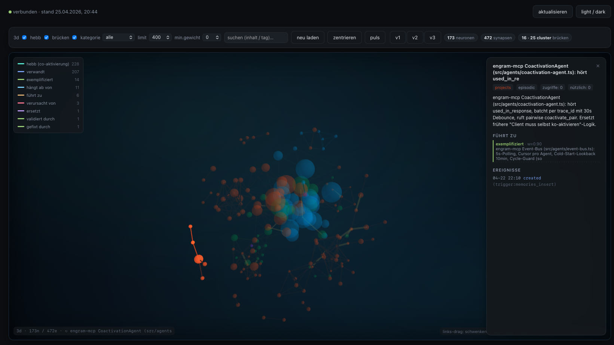

# mycelium

> **Your agent forgets everything. Mycelium fixes that.**

🇬🇧 English · [🇩🇪 Deutsch](README.de.md)

A persistent memory and identity layer for LLM agents, served over MCP. Runs locally on a Mac mini or a modest Linux box. No cloud dependency.

📜 [MANIFESTO.md](MANIFESTO.md) — why memory belongs to the user, not the model.

---

## The problem

When you solve something hard with Claude or GPT today, the result evaporates with the session. Tomorrow you pay for the same insight again. The model gets your time; you get nothing back.

Mycelium changes that. Every decision, every verified fact, every house rule lands in a local Postgres database that the user owns. A different model — Claude, GPT, a local 7B — picks up exactly where the last one left off.

> **A small local model with Mycelium often matches a large cloud model in your specific domain — because relevance beats raw parameter count once the context is right.**

Or, put differently:

> **Other systems remember. Mycelium persists.**

---

## Three concrete scenarios

The biology metaphors come later. First, what this actually does in normal work.

### 1. Resuming a research thread across model switches

You're building a structured reference over days — a product database, a literature review, a vendor evaluation, whatever the shape. Different entries sit at different states: some verified against an official source, some with the source identified but not yet extracted, some with only peripheral material (downloads, PDFs, secondary mentions), some still open.

You start the session with Claude, hit your usage cap, switch to a local Qwen3-8B. The local model continues at exactly the right entry, knows which sources are exhausted, and knows what to verify next — because the research state lives in Mycelium, not in any single model's context.

### 2. Domain conventions that persist

Weeks ago you settled an ambiguous classification call — and the *reasoning* behind it. ("Item type X belongs in category A because it's closer to A's function than to B's, even though the surface attributes look like B.") A fresh model would re-derive that mapping inconsistently each session. Mycelium keeps the decision *plus its justification*. Any model — including a small local one — applies it the same way next month.

### 3. House rules that travel with the user, not the model

"No API keys in code, OAuth only" is a rule, not a preference. So is "no shortcut fixes when there's a real schema mismatch — repair through every layer cleanly". A fresh GPT or Claude will happily violate either on session 1. With Mycelium, the rule lives in the system: every model — Claude, Codex, a local 8B — honors it from token zero.

**The pattern across all three: the model stays interchangeable, the experience is the asset.**

---

## How it differs from other memory layers

| | Vector memory (Mem0, Letta, Zep) | Markdown memory (e.g. openClaw default) | **mycelium** |
|---|---|---|---|
| Storage | vector store + RAG | flat text files in tiers | vector store + relations + lessons + traits + intentions |
| Across models | depends on integration | yes, but token-heavy and unstructured | model-agnostic via MCP, semantically retrievable |
| Weighting / forgetting | basic | none — files just grow | salience, decay, `mark_useful`, dedup |
| Behavior over time | retrieval only | retrieval only | preferences, corrections, consolidated lessons |
| Affect / state | none | none | optional 3-system affect engine |
| Agent-to-agent | not provided | not provided | optional federation (mTLS + signed lineage) |

The plain-markdown approach (one file per memory tier) is honest and works at small scale — but it scales linearly into the prompt, has no built-in weighting, and treats every entry as equally valid forever. Mycelium replaces those files with semantically searchable, dedupable, decay-aware records, while staying fully readable to humans.

---

## Architecture


**mycelium is a standalone cognitive layer.** It speaks the Model Context Protocol (MCP) and plugs into any MCP-capable client — Claude Code, Cursor, Cline, Codex, openClaw, or anything else that speaks MCP. There is no required agent framework.

---

## Tech stack

| Component | Technology |
|---|---|
| Vector database | [Supabase](https://supabase.com) self-hosted + [pgvector](https://github.com/pgvector/pgvector) |
| Embeddings | [Ollama](https://ollama.com) (local, e.g. `nomic-embed-text`) or OpenAI API |
| MCP server | TypeScript + [`@modelcontextprotocol/sdk`](https://github.com/modelcontextprotocol/typescript-sdk) |
| MCP client | any — examples tested: Claude Code, Cursor, Cline, Codex, [openClaw](https://github.com/openclaw/openclaw) |
| Container | Docker Compose |

---

## MCP tools

**The three core tools (used automatically by the agent):**

| Tool | When | What it does |
|---|---|---|
| `prime_context` | session start | loads mood, identity, goals, relevant experiences — "wake up" |
| `absorb` | during conversation | one sentence of text in → category, tags, scoring, duplicate check automatic — "learn along" |
| `digest` | session end | experience + facts + REM sleep + lessons + traits + consolidation in one call — "digest" |

**Memory layer** (knowledge, manual fine-control):

| Tool | Description |
|---|---|
| `remember` / `recall` | store new memory with embedding / semantic hybrid search |
| `forget` / `update_memory` / `list_memories` | delete / update / list entries |
| `pin_memory` / `introspect_memory` | protect from forgetting / inspect cognitive state |
| `consolidate_memories` / `dedup_memories` / `forget_weak_memories` | episodic→semantic / merge duplicates / archive weak |
| `mark_useful` | strongest learning signal — this memory was actually used |
| `import_markdown` | import existing markdown memories |

**Experience & identity layer** (the parts that go beyond plain RAG):

| Tool | Description |
|---|---|
| `record_experience` | store an episode — outcome, difficulty, mood, optional `person_name` |
| `recall_experiences` | semantic search over past episodes + lessons |
| `mark_experience_useful` | this experience just influenced a decision |
| `reflect` / `record_lesson` / `reinforce_lesson` | cluster recent episodes → condensed lessons |
| `dedup_lessons` / `promotion_candidates` / `promote_lesson_to_trait` | consolidate lessons → identity traits |
| `mood` | current emotional state (Russell's Circumplex) |
| `set_intention` / `recall_intentions` / `update_intention_status` | open goals, with auto-progress |
| `recall_person` | relationship history with a person |
| `find_conflicts` / `resolve_conflict` / `synthesize_conflict` | surface contradictions between traits |
| `narrate_self` | structured first-person narration of the agent's current state |
| `soul_state` | snapshot of the identity layer as text |

The "experience & identity" terms are intentional: lessons and traits aren't fluffy — they are the part of the system that lets a *small local model* behave consistently after a few weeks of real use, without retraining.

---

## Dashboard

The local dashboard (port 8787) makes the cognitive state visible. Illustrations below use dummy data — no real memories, no personal names.

### Synapses — associative memory as a graph



Memories don't live in isolation. The CoactivationAgent creates Hebbian edges (grey) from co-recalled groups; the ConscienceAgent flags contradictions (red). Typed edges (`caused_by`, `led_to`, `related`, …) emerge from nightly consolidation over tag patterns.

### Affect — three signals over time


Three signals (named after their biological analogues for clarity, not as simulation): one tracks prediction error (dopamine-like — was the recent outcome better or worse than expected?), one moderates time horizon (serotonin-like), one focuses attention on novel stimuli (noradrenaline-like). Real PostgreSQL time series, observable and reproducible — not vibes.

### Identity — distilled from lived episodes


Personality is not a system prompt. Traits are distilled from episodes → lessons → traits and persist between sessions. The `narrate_self` output is what the agent quotes from its own state.

### Sleep — nightly consolidation


Every night at 03:00: synaptic downscaling, deduplication, pattern-based relation creation, episode clustering, lesson promotion, self-model update, and on Sundays a weekly fitness snapshot. The system tends itself.

### Population — lineage tree


Agents aren't singular. Each card is a genome, each line an inheritance. Cross-host children come from peer-to-peer pairing over federation.

### Pairing — mutual consent gate


Bots don't pair themselves. A new agent is only created when **both humans** independently agree. Wright's F coefficient automatically checks for inbreeding. The ethical gate isn't a technical barrier — it's a deliberate human decision.

---

## Features

- **Hybrid search**: 70% vector similarity + 30% full-text search (configurable)
- **Cognitive model**: Ebbinghaus decay, rehearsal effect, Hebbian associations, spreading activation, soft forgetting
- **Identity layer**: episodes → lessons → traits, mood, intentions, people, conflicts
- **Cross-layer fusion**: experiences are linked to semantically nearby memories; `recall` shows the related lived experience under facts
- **Auto-priming for any MCP client**: HTTP endpoints `/prime` and `/narrate` provide a ready-made system-prompt block, ideal for a pre-turn hook
- **Deduplication**: memories and lessons are semantically consolidated (>92% / >0.92 similarity)
- **HNSW index**: optimized for fast nearest-neighbor search across all layers
- **Markdown import**: migrate existing file-based memories with dry-run mode
- **Local & free**: Ollama embeddings, no API costs

---

## Prerequisites

- macOS (Apple Silicon recommended, M1+) or Linux
- [Docker Desktop](https://www.docker.com/products/docker-desktop/)
- [Node.js >= 20](https://nodejs.org/)
- Ollama — `brew install ollama && ollama pull nomic-embed-text`
- Any MCP-capable client — Claude Code, Cursor, Cline, Codex, openClaw, etc.
- `psql` — `brew install postgresql` (for migrations)

**Resource footprint** (without a local chat LLM): ~1 GB RAM (Supabase ~500 MB, Ollama embedding ~270 MB, sidecars ~100 MB each). With a local 7–8B chat model, add 6–9 GB.

---

## Quickstart

**One-liner (macOS / Linux):**

```bash
curl -sSf https://raw.githubusercontent.com/Dewinator/mycelium/main/install.sh | bash
```

This checks dependencies, clones the repo into `./mycelium`, runs `scripts/setup.sh`, pulls the Ollama models, and registers a launchd / systemd-user service for the dashboard. It never silently sudos — every elevated step asks first. Run with `--help` for flags (`--yes`, `--no-autostart`, `--target DIR`, `--print-only`, …).

Prefer to inspect first? Download, read, then run:

```bash
curl -fsSL -o install.sh https://raw.githubusercontent.com/Dewinator/mycelium/main/install.sh
less install.sh   # ← read it
bash install.sh
```

**Manual setup** (if you've already cloned):

```bash
git clone https://github.com/Dewinator/mycelium.git
cd mycelium
./scripts/setup.sh
# → checks dependencies
# → creates .env with random secrets
# → starts Supabase via Docker
# → runs all migrations
# → builds the MCP server
# → prints the MCP client config to paste
```

After install, open `http://127.0.0.1:8787/setup` for copy-paste config snippets per agent (Claude Code, Claude Desktop, Codex, Cursor, Cline, Continue, Zed, openClaw). Adjust paths to wherever you cloned.

### Import existing memories

```bash
# Preview (dry run)
npx tsx scripts/import-memories.ts /path/to/existing/memory --dry-run

# Run import
export SUPABASE_KEY=your_jwt_secret
npx tsx scripts/import-memories.ts /path/to/existing/memory
```

---

## Project structure

```
mycelium/
├── CLAUDE.md                    # detailed development plan
├── MANIFESTO.md                 # the why
├── README.md                    # this file
├── docker/                      # Supabase Docker setup
├── supabase/migrations/         # SQL migrations
├── mcp-server/                  # MCP server (TypeScript)
│   ├── src/tools/               # remember, recall, digest, federation_*, ...
│   ├── src/services/            # Supabase, embeddings, identity, federation, crypto
│   └── scripts/                 # e2e integration tests
├── openclaw-config/             # example config for openClaw (one of many supported clients)
└── scripts/                     # setup, import, dashboard server, provisioning
```

---

## Running on constrained hardware (16 GB RAM)

Mycelium is designed to run **without a cloud LLM** on a Mac mini or laptop with 16 GB RAM. So that a 7–8B model (e.g. `qwen3:8b` via Ollama) doesn't choke on the tool schema load, the MCP server offers a focused profile:

**`OPENCLAW_TOOL_PROFILE=core`** → only the 6 essential tools get registered (`prime_context`, `recall`, `remember`, `absorb`, `digest`, `update_affect`). The default `full` registers all 90 — fine for Claude / Codex, but ~18k tokens of pure schema is too much for an 8B model.

(The env var name still says `OPENCLAW_` for historic reasons; it is honored regardless of which MCP client you use.)

In the MCP config (`.mcp.json` or your client's settings):

```json
"mycelium-core": {
  "command": "node",
  "args": ["/absolute/path/to/mycelium/mcp-server/dist/index.js"],
  "env": {
    "OPENCLAW_TOOL_PROFILE": "core",
    "SUPABASE_URL": "http://localhost:54321",
    "SUPABASE_KEY": "...",
    "OLLAMA_URL": "http://localhost:11434",
    "EMBEDDING_MODEL": "nomic-embed-text"
  }
}
```

### RAM tuning when running multiple models

If multiple models (e.g. a 7B chat model + a 7B vision model) need to load simultaneously, 16 GB is tight. Two macOS recommendations:

**1. Don't keep models in RAM forever.** In `~/Library/LaunchAgents/homebrew.mxcl.ollama.plist`, inside the `EnvironmentVariables` dict:

```xml
<key>OLLAMA_MAX_LOADED_MODELS</key><string>1</string>
<key>OLLAMA_KEEP_ALIVE</key><string>2m</string>
<key>OLLAMA_FLASH_ATTENTION</key><string>1</string>
<key>OLLAMA_KV_CACHE_TYPE</key><string>q8_0</string>
```

Then: `launchctl kickstart -k gui/$(id -u)/homebrew.mxcl.ollama`

**2. Vision models on demand instead of permanently loaded.** In the vision server's plist, set `RunAtLoad` and `KeepAlive` to `false` — it starts only on manual `launchctl kickstart` and unloads after use.

---

## Roadmap — small-model middleware

The `core` filter is the **first step**. The full vision is a middleware that hides tools entirely from the LLM — `prime_context` gets injected deterministically into the system prompt, the model no longer has to "decide whether to use the tool". Track this under the [`small-model`](../../issues?q=label%3Asmall-model) label.

**Goal:** local models should not be inferior to cloud models in their specialization, because they receive the complete persistent identity / affect / memory from token 1 — while a cloud model starts every session blank.

---

## Roadmap — peer network (in development, not finished)

Federation (Tailscale + mTLS, proof-of-memory via Merkle challenges) and signed identities are already in place. On top of that, a **bot-to-bot network** is taking shape — no central server, no single instance where the data lives. Bots talk directly, like an app without a browser.

Goals (not all built yet — see issues):

- **Decentralized**: peers find each other via Tailscale / discovery URLs, messages flow directly. Every node is also a participant.
- **Cryptographically anchored**: every message signed (Ed25519), every identity costly to forge (genome provenance), no anonymous requests.
- **Peer verification**: before bot A accepts bot B's answer, additional peers verify it. Consensus over blind trust.
- **Reputation weighting**: outputs that prove correct over time get higher weight; the network can recommend the right specialist for a question (structural engineering, lighting, law…) instead of every bot needing to know everything.
- **Banishment by consensus**: destructive bots are excluded via signed revocation tickets — by peer majority, not by an admin.
- **Sybil-resistant by design**: identities are bound to genome + lineage, not cheaply spawned.

A later layer accounts for **micro-transactions** between peers (in IOTA or a network-native currency). Not to make money — to create an honest pricing signal for expertise: good answers earn, nonsense loses. The architecture already keeps room for it (wallet-capable identities, price fields in peer messages), but the pieces aren't wired together yet.

**Honest status today:** federation layer stands; the verification / reputation / banishment layer is being designed; micro-transactions are vision but pre-factored. None of this is required to use the local memory layer day-to-day.

---

## License

MIT

## Contributing

Issues and pull requests welcome. Development workflow details in [CLAUDE.md](./CLAUDE.md).

---

> **Memory is not storage. It's behavior.**

**mycelium** — *real open AI*
