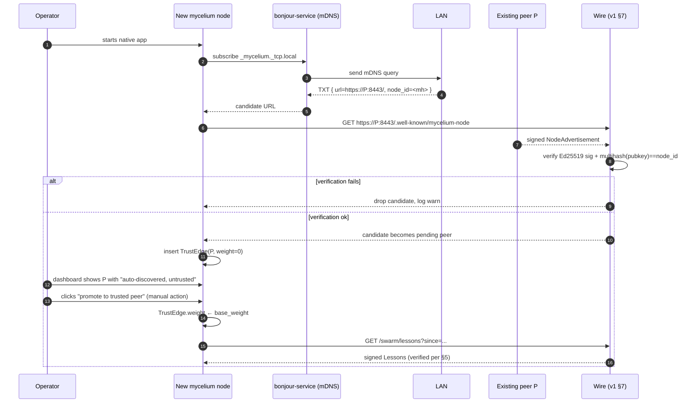

# P2P discovery without central tracker — Wave 3 design spike

> Status: **design spike, no code yet.** This doc proposes how `SWARM_SPEC v1`'s
> bootstrap-list discovery (§4.1, §4.2, §7) extends to a v2-class
> tracker-free discovery layer — mDNS for LAN, libp2p Kademlia DHT for WAN —
> without weakening any of the three Designprinzipien (§0) or the six
> Constitution pillars.
>
> **Source intention** (Reed 2026-05-02, vector-memory):
>
> > *"Ich will P2P-Discovery für mycelium-Knoten ohne zentralen Tracker —
> > mDNS im LAN für die Sofort-Entdeckung lokaler Peers (Familie, WG,
> > Büro), libp2p-DHT optional für globale Discovery ohne
> > Tech-Giganten-Infrastruktur. Ziel: zwei mycelium-Instanzen finden
> > einander, etablieren mTLS-Trust, beginnen Lessons auszutauschen —
> > alles ohne dass irgendein Server außer den eigenen beteiligt ist.
> > Welle 3."* (priority 0.85, progress 10%)
>
> **Sequencing.** This doc does **not** propose merging discovery into v1.x.
> Wave 1 (native app, epic [#176](https://github.com/Dewinator/mycelium/issues/176))
> and Wave 2 (second peer + public seed) ship first. Discovery work begins
> after those land. The point of writing this now is so that v1.x design
> decisions still in flight (Tauri shell, sidecar lifecycle, native net
> permissions) can keep Wave 3's needs in view instead of having to be
> retrofitted.

## Question this spike answers

`SWARM_SPEC v1` (§4.1–§4.2, §7, §6) defines three things and explicitly
defers one:

- **Defined:** `GET /.well-known/mycelium-node` (every node exposes its
  signed `NodeAdvertisement`), `GET /swarm/peers` (curated relay view),
  the gossip walk in §7 — *given* you already know at least one peer.
- **Deferred to v2** (§6): NAT traversal, libp2p / Kademlia DHT, WebSocket
  push, key rotation.

What `v1` does **not** answer is: *"how does a fresh node find its very
first peer when the operator has not been handed a bootstrap URL?"* In v1,
the answer is "the operator pastes a peer URL into config." That is fine
for the second-peer bootstrap (Wave 2) but unacceptable for the
"two mycelium instances on the same WiFi find each other automatically"
experience Reed explicitly named for Wave 3.

This spike answers four concrete questions:

1. **What is the smallest extension to the v1 wire protocol** that turns
   "I know a URL" into "I can be discovered without a URL"?
2. **Which library/stack** gives us LAN-mDNS and WAN-DHT discovery on
   macOS, Windows, and Linux **inside the Tauri sidecar** without pulling
   in a heavyweight runtime or duplicating identity material?
3. **How does discovery connect to the existing `node_identity` / signed
   `NodeAdvertisement` / `TrustEdge` machinery** so that "found" never
   collapses into "trusted"?
4. **What attacks does tracker-free discovery enable**, and which of
   them does the existing v1.1 self-healing layer (§10) already neutralize?

## TL;DR

- **Three discovery layers, all opt-in, all additive to v1:**
  L0 = bootstrap-list (v1, unchanged), L1 = LAN/mDNS (new), L2 = WAN/DHT
  (new). Operators can disable any layer; the default for the native app
  is `L0 on, L1 on, L2 off`. Pure-headless servers default `L0 on, L1 off,
  L2 off`.
- **mDNS service name: `_mycelium._tcp.local`,** payload is the
  `NodeAdvertisement` URL, not the advertisement itself. Receivers fetch
  `/.well-known/mycelium-node` over HTTPS exactly like the bootstrap
  path — mDNS is a **pointer**, never a substitute for the signed record.
- **Library pick: `bonjour-service` (npm)** for mDNS in the sidecar.
  Pure-JS, zero native deps, works on all three OSes via UDP multicast.
  Avoid `mdns` (npm) — it requires building against system Avahi/Bonjour
  headers and breaks the "one Tauri sidecar artifact per OS" promise.
  Empirically validated on macOS — see [`experiments/swarm-discovery/`](../experiments/swarm-discovery/):
  - mDNS layer alone ([`report-mdns.json`](../experiments/swarm-discovery/report-mdns.json),
    [`report-mdns-two-process.json`](../experiments/swarm-discovery/report-mdns-two-process.json)):
    publish 254 ms, self-discover 613 ms in single-process; in a separate
    discoverer process, first-seen at 32 ms — well under the 2 s budget,
    coexists with the OS mDNSResponder daemon.
  - **Full pointer→fetch loop** ([`spike-mdns-fetch.mjs`](../experiments/swarm-discovery/spike-mdns-fetch.mjs),
    [`report-mdns-fetch-discoverer.json`](../experiments/swarm-discovery/report-mdns-fetch-discoverer.json)):
    publisher serves a mock `/.well-known/mycelium-node` on an ephemeral
    HTTP port + advertises the URL via mDNS TXT; a separate discoverer
    process resolves the service in 21 ms, fetches the URL in 14 ms,
    JSON-parses the body, and runs the same shape check as
    `wire-types.ts:kindOf` on the response. Total **37 ms** discover →
    fetch → shape-validated `node_advertisement`. This is the single
    end-to-end empirical evidence that the "mDNS-as-pointer" architecture
    works as a wire — not just that mDNS multicast resolves.

  Loopback note: the fetch spike binds to `127.0.0.1` for the URL because
  cross-host `.local` hostname resolution is environment-dependent and
  orthogonal to the pointer-fetch question this spike answers; bonjour-service
  surfaces the discovered peer's IP addresses in its `up` event, so a
  cross-host validation will use those rather than re-prove `.local` lookup.

  Linux (Avahi) and Windows are still open — re-run all three spikes on
  each platform before locking the pick. Cross-host (two machines on the
  same LAN) is also still open and is the next item.
- **WAN discovery: `js-libp2p` with a Kademlia DHT** (`@libp2p/kad-dht`),
  using only **public bootstrap nodes operated by mycelium users
  themselves** — never IPFS-network bootstrap. The DHT key is the
  multihash-encoded `node_id` (already specified in v1 §3.1); the value is
  the same advertisement URL pointer. **L2 is off by default** until the
  swarm has enough public peers to form a usable DHT (Reed plans this
  after Wave 2: own-server + public seed = first two stable bootstrap
  nodes).
- **Trust contract is unchanged.** Discovery only tells you a URL exists;
  every step that follows (`NodeAdvertisement` signature verification,
  multihash check against `node_id`, `TrustEdge.weight` decisions, Lesson
  rejection rules §5) runs identically whether the URL came from a config
  file, mDNS, or DHT. No new trust path, no new authority.
- **No spec-version bump for v1.** Discovery is **transport-side**, not
  wire-format-side. SWARM_SPEC §1 says minor bumps are reserved for
  backward-compatible *additions to signed records or endpoints*. mDNS
  and DHT add neither — they are **out-of-band hints**. We document this
  layer as "supplementary discovery, MAY-implement, does not affect
  spec compatibility."
- **Two follow-up issues to file before any code lands:** [A] mDNS
  responder + browser service in the Tauri sidecar; [B] DHT client behind
  `MYCELIUM_ENABLE_DHT=1` flag, off by default, with documented public
  bootstrap policy.

---

## The three discovery layers

```
                   ┌────────────────────────────────────────┐
   L2  WAN/DHT     │  js-libp2p Kademlia DHT                │
                   │  Key:  multihash(pubkey) = node_id     │
                   │  Value: advertisement URL              │
                   │  Bootstrap: mycelium-operated nodes    │
                   │  Off by default until swarm ≥ ~10 pub  │
                   └─────────────────┬──────────────────────┘
                                     │ optional
                   ┌─────────────────┴──────────────────────┐
   L1  LAN/mDNS    │  Service:  _mycelium._tcp.local        │
                   │  TXT:      url=https://host:port/      │
                   │            node_id=<multihash-b58>     │
                   │  Range:    UDP multicast 224.0.0.251   │
                   │  On by default in Tauri app            │
                   └─────────────────┬──────────────────────┘
                                     │
                   ┌─────────────────┴──────────────────────┐
   L0  Bootstrap   │  Operator pastes URL into config       │
                   │  Already specified in v1 §3.2 / §7     │
                   │  Always available, always last resort  │
                   └────────────────────────────────────────┘
                                     │
                   ┌─────────────────┴──────────────────────┐
   Wire (v1)       │  GET /.well-known/mycelium-node        │
                   │  GET /swarm/peers                      │
                   │  GET /swarm/lessons?topic=...          │
                   │  Signature verification + §5 rejection │
                   └────────────────────────────────────────┘
```

The crucial property: **L1 and L2 only feed candidate URLs into the v1
wire path.** They are not new trust roots. A node discovered via mDNS
goes through the *same* `NodeAdvertisement` fetch, the *same* Ed25519
signature check, the *same* multihash-vs-`node_id` consistency check, and
the *same* `TrustEdge` initialization (default weight 0 in v1). Nothing
about discovery changes how trust is earned.

### L1 — mDNS for the local network

**Use case:** Reed and his partner both run mycelium on their laptops at
home. Either laptop should be able to detect the other within seconds of
joining the WiFi, exchange `NodeAdvertisement` records, and let either
operator promote the auto-detected peer to a `TrustEdge.weight > 0`.

**Service definition:**

| field | value |
|---|---|
| Service type | `_mycelium._tcp.local` (per RFC 6763) |
| Instance name | `<friendly-host-name>-<short-node-id>` |
| Port | the same port as the v1 HTTPS endpoint |
| TXT records | `url=https://<host>:<port>/` , `node_id=<multihash-b58>` , `spec_version=1.1` |

The TXT records are **hints**, not trust artifacts. A receiver MUST still
fetch `/.well-known/mycelium-node` over HTTPS, verify the signature, and
verify that `multihash(pubkey) == node_id` exactly as v1 §7 requires. If
the TXT `node_id` disagrees with the verified one, the receiver discards
the discovery record and SHOULD log a quiet warning (not an alert — TXT
spoofing on a LAN is an everyday occurrence on coffee-shop WiFi).

**Library choice — `bonjour-service` (pure JS):**

| candidate | pros | cons | verdict |
|---|---|---|---|
| `bonjour-service` (npm, ~3 deps, MIT) | pure JS, no native build, works on macOS/Win/Linux out of the box, ~120 KB | re-implements the protocol — must trust upstream's RFC 6762 conformance | **pick** |
| `mdns` (npm) | wraps system Bonjour/Avahi, RFC-perfect | requires C++ build against system headers, breaks "one Tauri sidecar artifact per OS" goal | reject |
| `multicast-dns` (npm, primitive) | smaller surface | no service-browse abstraction, would need to layer one on | reject (more code to write than bonjour-service saves) |
| `dns-sd` shell-out | uses host stack | non-portable, Windows lacks a native CLI | reject |

`bonjour-service` is already used by libraries like `chromecast-api` and
`govee-lan-control` — there is operational evidence it works on the three
target OSes. The Tauri sidecar runs Node, so adding it costs ~120 KB and
zero build steps. **Net add to bundle size: negligible.**

**Failure modes on real LANs:**

- **mDNS blocked by enterprise WiFi.** Common in offices and hotels.
  Detection: 30 s after starting the responder, if the browser has not
  seen its own service echoed back from at least one router, log a
  one-line "mDNS appears blocked on this network — bootstrap-list still
  available" notice in the dashboard.
- **VPN with split tunnel.** mDNS often goes over the WiFi side, not the
  VPN side. This is the **expected** behaviour and what we want — Reed at
  home discovers Reed-at-home, not Reed-at-office.
- **VLAN segmentation.** Bonjour gateways exist (e.g. `mdns-repeater`)
  but are out of scope for v1 of this layer. Operators on segmented
  networks fall back to L0 bootstrap.
- **macOS sleep / Windows fast-startup.** The mDNS responder must
  re-announce on `wake` and `network-change` events. Tauri exposes both
  via its OS hooks; the sidecar listens and re-runs `bonjour.publish()`.

### L2 — Kademlia DHT for the wider internet

**Use case:** A new mycelium operator anywhere on the internet wants to
find the swarm without a paste-the-URL handshake. They run the app, and
within a few minutes their node joins a DHT and can resolve other
mycelium operators by `node_id`.

**Why DHT, why not a registry:**

- A registry (even a federated one) is exactly the kind of central
  authority Constitution Pillar 1 forbids.
- Pure gossip from L0 works as long as the swarm is connected, but a
  fresh installer with zero bootstrap URLs has no entry point.
- A DHT distributes the "directory" across the swarm itself. Any node
  that joins becomes part of the lookup substrate.

**Library choice — `js-libp2p` + `@libp2p/kad-dht`:**

| candidate | pros | cons | verdict |
|---|---|---|---|
| `js-libp2p` + `@libp2p/kad-dht` | mature, multi-transport (TCP/QUIC/WebSockets), already implements multihash identity that matches our `node_id`, MIT | large dep tree (~50 transitive packages), startup cost | **pick** |
| `bittorrent-dht` (npm) | small, BEP-5 compliant | binds us to BitTorrent's namespace — risk of accidental cross-discovery into the BT-DHT, plus our keys would not natively map to BT info-hashes | reject |
| Roll our own | full control | reinventing 15 years of Kademlia hardening | reject |

The libp2p DHT has a critical operational lever: **bootstrap nodes are
configurable.** We do **not** join the IPFS DHT. We define a private
mycelium DHT keyed by a swarm-specific protocol id
(`/mycelium/kad/1.0.0`), and the bootstrap list is mycelium-operated
nodes only. Wave 2 produces the first two such bootstrap nodes (Reed's
own server + the public seed). After ~10 stable public-reachable peers
exist, the DHT becomes self-sustaining and L2 default-on becomes
discussable.

**DHT record:**

```
key   = multihash-sha256(pubkey)        // exactly the v1 node_id
value = JCS-canonical signed envelope:
        {
          "url": "https://example.com:8443/",
          "node_id": "<same as key>",
          "signed_at": "2026-05-02T19:00:00Z",
          "ttl_seconds": 3600,
          "signature": "<Ed25519 over JCS bytes>"
        }
```

**The DHT MUST NOT store `NodeAdvertisement` itself.** The advertisement
includes capability declarations and may be revised between writes. The
DHT entry is a tiny *pointer* whose only job is to direct the lookup at
an HTTPS endpoint. Receivers fetch `.well-known/mycelium-node` from that
URL and use it as the source of truth.

**Off by default.** The flag `MYCELIUM_ENABLE_DHT=1` (env) or
`discovery.dht: true` (config) must be set explicitly. Reasoning:

- DHTs leak topology. Even with private bootstraps, joining advertises
  your IP to ~k DHT peers. An offline-first node has no business doing
  that until the operator opts in.
- Until the swarm has enough public peers, the DHT routing tables are
  too sparse to be useful. Default-off avoids embarrassing "joined the
  DHT, found nobody" first-run experience.
- Pillar 1 says "offline is the default-correct state." A node that
  *cannot* find peers is correct; a node that silently announces itself
  globally is not.

---

## Bootstrap flow — discovered node → ingested lessons



The **operator-in-the-loop step** at "clicks promote" is non-negotiable
in v1 of L1. We do not auto-trust LAN peers, even though the LAN
heuristic is "they are physically near you." Reed's family-WiFi case
still wants explicit consent — kids, IoT compromise, guest devices.
Auto-promotion of LAN peers is a separate feature (Wave 5+) gated on
mutual signed assertions, not on network locality.

L2 (DHT) discovered peers also start at `TrustEdge.weight = 0` and
require explicit operator promotion. The flow is identical to L1 except
the candidate URL came from a DHT lookup instead of an mDNS browse.

---

## Threat model

### Attacks that mDNS enables (L1)

| attack | mechanism | mitigation |
|---|---|---|
| **mDNS poisoning** | Attacker on the LAN advertises `_mycelium._tcp.local` with a TXT pointing at their own URL | Receiver MUST fetch the advertisement over HTTPS and verify the signature against `node_id`. The attacker would need to forge an Ed25519 signature, which is computationally infeasible. **Net effect: a poisoned mDNS record produces a candidate URL that fails verification and is discarded.** Logging keeps the operator informed without alarming them. |
| **mDNS flooding** | Attacker advertises 1000 fake services to exhaust receiver memory | Bound the candidate-URL queue at 256 entries per discovery cycle. Drop on overflow. The wire path is rate-limited per origin URL anyway. |
| **Information disclosure** | Attacker passively learns "this LAN has a mycelium node" | Accepted risk. The same is true of any LAN service. Operators on hostile networks (coffee shop) should disable L1 in config. |

### Attacks that DHT enables (L2)

| attack | mechanism | mitigation |
|---|---|---|
| **DHT eclipse** | Attacker places malicious nodes in the routing-table neighbourhood of a victim's `node_id` to control all lookups for it | Mitigated by DHT-level (libp2p has eclipse-resistance via S/Kademlia-style multi-disjoint lookups; we set `kBucket = 20`, redundancy ≥ 3). For mycelium specifically, eclipse only affects *discovery* — the wire signature check is unaffected. Worst case: a victim cannot discover a specific peer; they fall back to L0 (bootstrap URL). |
| **DHT pollution** | Attacker writes records under arbitrary `node_id` keys | DHT records are signed by their `node_id`'s private key. A pollution attempt fails the signature check on read. The attacker would need the private key, which would constitute a different (and worse) compromise. |
| **Topology disclosure** | DHT routing reveals "this IP runs mycelium" | Accepted risk; documented in the L2 opt-in dialog. Pillar 1 trades centralized convenience for sovereign cost; operators who must remain unobservable choose L0-only. |
| **Sybil attack on discovery** | Attacker creates many fake `node_id`s to dominate routing | Mitigated by the same multi-disjoint lookup that defeats eclipse, **and** by the v1.1 §10 self-healing layer at the lesson-ingest step: a Sybil swarm can be discoverable, but its Lessons fail diversity (§10.4) and contradict (§10.3) checks once they reach a real node. |

### Attacks that v1.1 already neutralizes (no new mitigation needed)

| attack | spec section | why discovery does not change the picture |
|---|---|---|
| Lesson forgery via discovery-poisoned URL | §3, §5 | Signature is over JCS bytes of the lesson, not the transport peer. A poisoned URL serving valid-but-malicious lessons is the same threat surface as L0 bootstrap. |
| Echo-chamber amplification by Sybil discovery | §10.4 (diversity pass) | Receiver-cohort diversity rejects amplification regardless of how many Sybil nodes broadcast. |
| Trust escalation via "many peers see this lesson" | §10.6 (two-tier pinning) | Tier promotion requires audited promotion, not popularity. |

The shape of the analysis is: **discovery widens the entry funnel; the
wire and §10 are the gate.** No discovery-layer attack creates a new
class of compromise. Worst case for L1/L2: the operator is shown a
candidate they did not want, fails to verify it, and the candidate is
silently dropped.

---

## Constitution check

| Pillar | Effect of this proposal | Verdict |
|---|---|---|
| **1 — Decentralized, networked AI** | L1 and L2 explicitly avoid central registries. L2 even self-hosts its bootstrap list within the swarm. | **Reinforces** |
| **2 — Agent reproduction** | Out of scope; discovery does not pair agents, it only locates nodes. | Untouched |
| **3 — Swarm intelligence** | More peers discoverable = more diverse lessons reachable = more Pillar-3 substrate. | **Reinforces** |
| **4 — Microtransactions** | Out of scope for v1 of this layer. Future: a discovered peer may include a payment-channel field in its advertisement. | Untouched |
| **5 — Experts in the swarm** | Discovery surfaces specialists; the trust+routing machinery still picks them by track record, not by reachability. | Neutral / supports |
| **6 — Cyber security** | All discovered candidates flow through the same Ed25519 + multihash + JCS verification path. No new trust root, no bypass. The `MYCELIUM_ENABLE_DHT` opt-in is conservative-by-default. | **Reinforces** |

No pillar is weakened. The proposal can be implemented as an additive
transport-side layer that ends at the same wire boundary v1.1 already
defines.

---

## Open questions deliberately deferred

1. **NAT traversal for L2.** A node behind symmetric NAT cannot serve
   its `/.well-known/mycelium-node` over HTTPS without help. STUN/TURN
   is explicitly out of scope per SWARM_SPEC §6. Wave 3 ships with the
   restriction "your node must be reachable" — i.e. either you have a
   public IP, or you set up port-forwarding, or you stay LAN-only via L1.
   A future Wave (5 or later) can add libp2p relays.
2. **DHT bootstrap-set governance.** Who decides which mycelium-operated
   nodes are "official" bootstrap entries? Wave 2 sidesteps this with
   "Reed's server + a single public seed." Once the swarm grows, this
   becomes a real governance question (Pillar 1 says: not a single
   gatekeeper). Plausible answer: a signed manifest distributed via the
   DHT itself, validated by a quorum of long-lived nodes. Not for this
   spike.
3. **Peer-handle naming.** `node_id` is a multihash, not human-readable.
   Wave 3 leaves "human-friendly handles" out of scope. A later layer
   might add Petname-style local aliasing — strictly client-side, never
   wire.
4. **Discovery on the dashboard.** The native-app dashboard needs a "new
   peers detected" panel. Design for that lives in the dashboard track,
   not here.
5. **IPv6 mDNS.** `bonjour-service` does both v4 and v6 by default.
   Some Tauri-bundled Node builds disable v6 mDNS. To-verify in the
   first implementation PR; not a spike-time decision.

---

## Concrete next steps

The following sequence is the proposed Wave-3 work plan. None of these
issues exist yet on GitHub.

| order | proposed issue title | scope | depends on |
|---|---|---|---|
| 1 | `feat(discovery): mDNS responder + browser in Tauri sidecar (L1)` | Add `bonjour-service`, advertise `_mycelium._tcp.local`, browse for the same, feed candidate URLs into the existing peer-pending pipeline. **Default on for the native app.** | Wave 1 (Tauri sidecar landed, #176) |
| 2 | `feat(discovery): "candidate peers" dashboard panel + promote action` | Surface mDNS hits to the operator with a "promote to trusted peer" button that flips `TrustEdge.weight` from 0 to `base_weight`. | issue 1 |
| 3 | `feat(discovery): private libp2p Kademlia DHT client (L2), default-off` | Add `js-libp2p` + `@libp2p/kad-dht` behind `MYCELIUM_ENABLE_DHT=1`. Define the `/mycelium/kad/1.0.0` protocol id. Bootstrap list: Wave-2 nodes only. | Wave 2 (≥ 2 stable public peers) |
| 4 | `feat(discovery): DHT pointer publish + lookup tool` | Sign and publish the URL pointer record on join; resolve `node_id → URL` on demand from the MCP tool surface. | issue 3 |
| 5 | `docs(discovery): operator guide — when to enable L1/L2, what each leaks` | Honest, unhyped explainer for the README/dashboard. | issues 1+3 |
| 6 | `feat(discovery): rate-limit + sanity caps on L1/L2 candidate ingestion` | 256-candidate cap per cycle, exponential back-off on repeatedly-failing URLs. | issues 1+3 |

Issue 1 is the smallest possible Wave-3 win: two laptops on the same
WiFi auto-detect, the operator clicks "trust", lessons start flowing.
Everything Reed asked for in the Wave-3 vision is satisfied by issue 1
alone for the LAN case. Issues 3+ unlock the WAN case after Wave 2's
public seed exists.

---

## What this spike does not do

- It does not propose changing `SWARM_SPEC.md`. Discovery is
  transport-side and out of scope for the wire-format spec. A future
  *operator-guide* doc may cross-reference this spike, but `SWARM_SPEC`
  itself remains the wire-format contract.
- It does not propose an implementation timeline. Wave 3 starts after
  Wave 2 ships; this spike is the design substrate that lets Wave 1
  (native app) avoid foreclosing on Wave-3 needs.
- It does not bind the Constitution. The pillar check above is a
  conformance argument, not an amendment. If implementation surfaces a
  pillar conflict not anticipated here, the implementation is wrong, not
  the Constitution.
